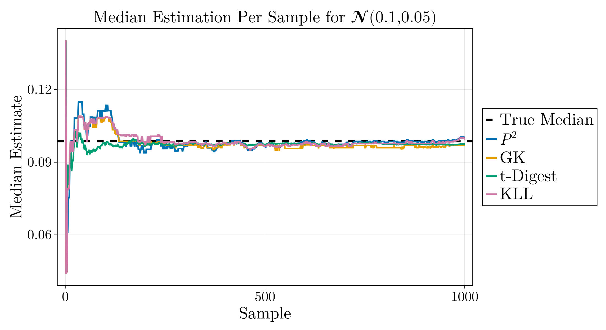

# SequentialQuantileEstimator.jl

**SequentialQuantileEstimator.jl** is a Julia package that provides streaming quantile estimation algorithms. It is useful for estimating quantiles (e.g., medians, percentiles) on-the-fly without storing the entire dataset in memory. This makes it suitable for large data streams or real-time analytics.

## Features

The package includes four well-known algorithms for quantile estimation:

1. **P² (P-square) Algorithm**:
   - O(1) time and memory complexity per update.
   - Ideal for quickly estimating a fixed quantile (such as the median).
   - Useful when memory is highly constrained.

2. **Greenwald-Khanna (GK) Algorithm**:
   - Provides deterministic approximation guarantees.
   - Can estimate any quantile with a specified error bound ε.
   - Memory usage: O(1/ε).

3. **t-Digest**:
   - Good accuracy, especially in the tails of the distribution.
   - Popular in industry for latency measurements and other skewed distributions.
   - Merges data efficiently, making it suitable for parallel or distributed systems.
   - &#9888; This is currently a simplified implementation (for the exact implementation see the work by Jain and Chlamtac)

4. **KLL (Karnin-Lang-Liberty) Sketch**:
   - Probabilistic approximation with strong theoretical guarantees.
   - Often uses less memory than GK for the same accuracy in practice.
   - Good balance between accuracy, memory, and complexity.
   - &#9888; This is currently a simplified implementation (for the exact implementation see the work by Karnin et al.)

## Example
The plot below shows the estimation of the median for a normal distribution with mean 0.1 and variance 0.05 over 1000 sample points of all 4 implemented algorithms.



## Installation

Currently, this package is not registered in Julia’s General registry. To use it, add the package directly from the GitHub repo into your project’s environment:

```julia-repl
(@v1.11) pkg> add https://github.com/smallpondtom/SequentialQuantileEstimator.jl.git
```

Alternatively, you can use `include` directly if you have the files cloned locally.

## Usage

### Basic Structure

The repository is structured as follows:

```
SequentialQuantileEstimator.jl
algorithms/
    P2.jl
    GK.jl
    TDigest.jl
    KLL.jl
```

`SequentialQuantileEstimator.jl` is the main file that loads each algorithm’s submodule. Each submodule provides its own initialization and update functions.

### Example: Estimating the Median

```julia
import SequentialQuantileEstimator as SQE

data = randn(1000)

# P² example (median estimation)
p2_est = SQE.P2.p2_init([0.5])  # Initialize P² estimator for median
for x in data
    p2_est = SQE.P2.p2_update!(p2_est, x)
end
median_est = SQE.P2.p2_get_quantiles(p2_est)[1]
println("P² median estimate: ", median_est)

# GK example
gk_est = SQE.GK.gk_init(0.01) # Initialize GK estimator with ε=0.01
for x in data
    gk_est = SQE.GK.gk_update!(gk_est, x)
end
println("GK median estimate: ", SQE.GK.gk_get_quantile(gk_est, 0.5))

# t-Digest example
td_est = SQE.TDigest.tdigest_init(100.0)
for x in data
    td_est = SQE.TDigest.tdigest_update!(td_est, x)
end
println("t-Digest median estimate: ", SQE.TDigest.tdigest_get_quantile(td_est, 0.5))

# KLL example
kll_est = SQE.KLL.kll_init(200)
for x in data
    kll_est = SQE.KLL.kll_update!(kll_est, x)
end
println("KLL median estimate: ", SQE.KLL.kll_get_quantile(kll_est, 0.5))
```

### Adapting to Multiple Quantiles

Most estimators can be initialized with multiple quantiles. For example, with P²:
```julia
import SequentialQuantileEstimator: SQE
p2_multi = SQE.P2.p2_init([0.25, 0.5, 0.75])
for x in randn(1000)
    p2_multi = SQE.P2.p2_update!(p2_multi, x)
end
q_estimates = SQE.P2.p2_get_quantiles(p2_multi)
println("Estimated quartiles: ", q_estimates)
```

## Comparison and Benchmarking

Each algorithm trades off memory, computation, and accuracy:
- **P²**: Very fast, very small memory, but limited flexibility.
- **GK**: Strong deterministic guarantees, memory O(1/ε).
- **t-Digest**: Good overall accuracy, especially in tails, good mergeability.
- **KLL**: Good probabilistic guarantees, often less memory than GK, good accuracy.

You can benchmark algorithms by generating synthetic data (e.g., from a `Normal`, `Cauchy`, or `Exponential` distribution) and comparing estimated quantiles to ground truth.

## Contributing

Contributions are welcome! Feel free to open issues or submit pull requests if you find bugs, want to improve accuracy or performance, or add new streaming quantile algorithms.

## References

1.  Jain, R., & Chlamtac, I. (1985). The P² algorithm for dynamic calculation of quantiles and histograms without storing observations. *Communications of the ACM*.
2. Greenwald, M., & Khanna, S. (2001). “Space-efficient online computation of quantile summaries.” SIGMOD.
3. Dunning, T., & Ertl, O. t-Digest: [https://github.com/tdunning/t-digest](https://github.com/tdunning/t-digest).
4. Karnin, Z., Lang, K., & Liberty, E. (2016). “Optimal Quantile Approximation in Streams.” FOCS.

## License

This project is available under the MIT License. See [LICENSE](LICENSE) for details.